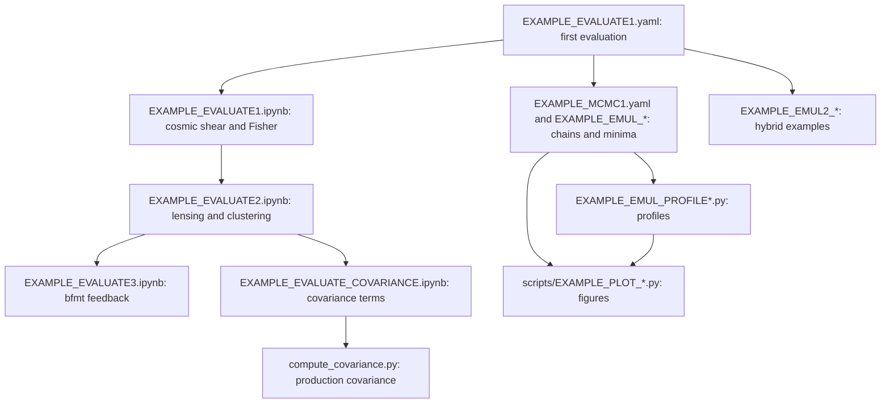

# Table of contents <a name="table_of_contents"></a>

1. [Reading path through the examples](#reading_path)
2. [Running Cosmolike projects (Basic instructions)](#running_cosmolike_projects)
3. [Baryonic feedback on EXAMPLE_EVALUATE1 and EXAMPLE_EVALUATE3](#lsst_y1_baryonic_feedback)
4. [Running ML emulators](#cobaya_base_code_examples_emul)
5. [Running Hybrid Cosmolike-ML emulators](#cobaya_base_code_examples_emul2)
6. [Running Fisher](#lsst_examples_fisher)
7. [Unit tests](#unit_tests)
8. [Computing covariances](#computing_covariances)
9. [Exploring notebooks](#notebooks)
10. [Appendix: Which accuracy settings are available?](#accuracy)

# Reading path through the examples <a name="reading_path"></a>

Start with one evaluation of `EXAMPLE_EVALUATE1.yaml`
([basic instructions](#running_cosmolike_projects)): it checks the
installation that every later example uses.



- The three data-vector notebooks share one fiducial point.
  `EXAMPLE_EVALUATE1.ipynb` introduces the wrapper calls on cosmic shear,
  `EXAMPLE_EVALUATE2.ipynb` adds the lens probes of the 3×2pt data
  vector, and `EXAMPLE_EVALUATE3.ipynb` applies the `bfmt` feedback
  models to that vector. The last one needs `bfmt` and its emulators
  installed ([baryonic feedback](#lsst_y1_baryonic_feedback)).
- The covariance notebook and the production CLI need the optional
  covariance build ([computing covariances](#computing_covariances)).
- The CosmoLike chain and the emulator samplers write chains and minima
  under `chains/`. The profile scripts read a minimum (`--minfile`) and,
  optionally, a chain covariance (`--cov`); the plotting scripts read the
  chains, minima and profiles ([ML emulators](#cobaya_base_code_examples_emul)).
- The hybrid examples ([hybrid emulators](#cobaya_base_code_examples_emul2))
  use neither the data-vector emulators nor those chains.

# Running Cosmolike projects (Basic instructions) <a name="running_cosmolike_projects"></a> 

> [!WARNING]
> **CLI for production; notebook wrappers for exploration.**
>
> Run production and HPC calculations from YAML through the optimized
> `_interface` bindings. Notebook `_wrapper` APIs expose intermediate
> quantities for exploration; copying and rearranging their arrays adds
> overhead. Both routes call the same C kernels.
>
> In a matched **LSST Y1 covariance** test on an M2 Pro with eight threads,
> the CLI averaged **50.23 s** (three runs); one wrapper run took **173.38 s**.
> The CLI was **3.45× faster**, with bitwise-identical covariance components.
> See [the production covariance CLI](#computing_covariances).

> [!Warning]
> CosmoLike supports the optimized strict-IEEE default build and
> `COSMOLIKE_DEBUG_MODE`. The compiler mode `COSMOLIKE_AGGRESSIVE_MODE`
> is not supported: the build stops with an error when it is set, because
> its fast-math configuration produces incorrect covariance inverses.
> Unset that variable before compiling.
> Do not enable `-ffast-math`, `-Ofast`, `-funsafe-math-optimizations`,
> `-fassociative-math`, `-ffinite-math-only`, `-freciprocal-math`,
> `-fno-signed-zeros`, or `-fno-trapping-math` in CosmoLike builds.
> This does not change Cocoa's separate `--aggressive` download option.

From `Cocoa/Readme` instructions:

> [!Note]
> `setup_cocoa.sh` and `compile_cocoa.sh` install and compile the cosmolike projects selected in `set_installation_options.sh`. A commented `IGNORE_COSMOLIKE_*_CODE` key enables a project; an active key skips it. The defaults enable LSST Y1, DES × Planck and Roman real.
> 
>     [Adapted from Cocoa/set_installation_options.sh shell script]
>     #export IGNORE_COSMOLIKE_LSST_Y1_CODE=1
>     export IGNORE_COSMOLIKE_DES_Y3_CODE=1
>     #export IGNORE_COSMOLIKE_DESXPLANCK_CODE=1
>     export IGNORE_COSMOLIKE_ROMAN_FOURIER_CODE=1
>     #export IGNORE_COSMOLIKE_ROMAN_REAL_CODE=1
>     export IGNORE_COSMOLIKE_ROMAN_KL_CODE=1
>     export IGNORE_COSMOLIKE_DES_CLUSTER_CODE=1
>     # WARNING: des_y6 is not production ready.
>     export IGNORE_COSMOLIKE_DES_Y6_CODE=1
>     (...)
>     export LSST_Y1_URL="https://github.com/CosmoLike/cocoa_lsst_y1.git"
>     export LSST_Y1_NAME="lsst_y1"
>     export LSST_Y1_GIT_TAG="v5.05"
>
> Each released project is pinned to a tag. To select another revision, set only one of its `GIT_COMMIT`, `GIT_BRANCH` or `GIT_TAG` keys (here `LSST_Y1_GIT_COMMIT`, `LSST_Y1_GIT_BRANCH` or `LSST_Y1_GIT_TAG`): a commit takes precedence over a branch, and a branch over a tag. With none set, Cocoa clones the repository's default branch.

> [!NOTE]
> Rerunning `setup_cocoa.sh` (or `./installation_scripts/setup_cosmolike_projects.sh`) keeps an existing `projects/lsst_y1` folder, so uncommitted work survives. To replace the folder with a fresh clone, add the key below to `set_installation_options.sh` before rerunning; it deletes the folder first.
>
>     export OVERWRITE_EXISTING_COSMOLIKE_CODE=1 # dangerous (possible loss of uncommitted work)
>

> [!NOTE]
> If users want to recompile cosmolike, there is no need to rerun the Cocoa general scripts. Instead, run the following three commands:
>
>      source start_cocoa.sh
>
> and
> 
>      source ./installation_scripts/setup_cosmolike_projects.sh
>
> and
> 
>       source ./installation_scripts/compile_all_projects.sh
> 
> or (in case users just want to compile the lsst-y1 project)
>
>       source ./projects/lsst_y1/scripts/compile_lsst_y1.sh

> [!TIP]
> Assuming Cocoa is installed on a local (not remote!) machine, type the command below after step 2️⃣ to run Jupyter Notebooks.
>
>     jupyter notebook --no-browser --port=8888
>
> The terminal will then show a message similar to the following template:
>
>     (...)
>     [... NotebookApp] Jupyter Notebook 6.1.1 is running at:
>     [... NotebookApp] http://f0a13949f6b5:8888/?token=XXX
>     [... NotebookApp] or http://127.0.0.1:8888/?token=XXX
>     [... NotebookApp] Use Control-C to stop this server and shut down all kernels (twice to skip confirmation).
>
> Now go to the local internet browser and type `http://127.0.0.1:8888/?token=XXX`, where XXX is the previously saved token displayed on the line
> 
>     [... NotebookApp] or http://127.0.0.1:8888/?token=XXX
>
> The project lsst-y1 contains jupyter notebook examples located at `projects/lsst_y1`.

> [!NOTE]
> The example notebooks load their shared support functions from
> `Cocoa/external_modules/code/cosmolike_core/cosmolike_notebook_utils/`:
> the CAMB run packaged for cosmolike, the data-vector plots, and the
> Fisher-forecast helpers, called through the `cnu` namespace. What is
> specific to this project lives in
> `interface/cosmolike_lsst_y1_notebook_wrappers.py`, imported as `nw`:
> the fiducial point and the probe, $`\chi^2`$, Fisher and `bfmt`
> wrappers around the compiled-interface calls.

To run the example

 **Step :one:**: activate the Cocoa Conda environment,  and the private Python environment 

      conda activate cocoa

and

      source start_cocoa.sh
 
 **Step :two:**: Select the number of OpenMP cores (the commands below set it to 8).

  - Linux
    
        export OMP_NUM_THREADS=8; export OMP_PROC_BIND=close; \
        export OMP_PLACES=cores; export OMP_DYNAMIC=FALSE; \
        export OPENBLAS_NUM_THREADS=1; export MKL_NUM_THREADS=1

  - macOS (arm)
    
        export OMP_NUM_THREADS=8; export OMP_PROC_BIND=disabled; \
        export OMP_PLACES=cores; export OMP_DYNAMIC=FALSE; \
        export OPENBLAS_NUM_THREADS=1; export MKL_NUM_THREADS=1

 **Step :three:**: The folder `projects/lsst_y1` contains examples. So, run the `cobaya-run` on the first example following the commands below.

> [!Warning] 
> (Linux only) In some HPC nodes, `numa` can cause you problems. If that is the case,
> replace `numa` with `slot`

- **One model evaluation**:

  - Linux

        "${CONDA_PREFIX}"/bin/mpirun -n 1 --oversubscribe --mca pml ob1 --mca btl vader,tcp,self \
          --bind-to core:overload-allowed --report-bindings \
          --rank-by slot --map-by numa:pe=${OMP_NUM_THREADS} \
          cobaya-run ./projects/lsst_y1/EXAMPLE_EVALUATE1.yaml -f

  - macOS (arm)

        mpirun -n 1 --oversubscribe \
          cobaya-run ./projects/lsst_y1/EXAMPLE_EVALUATE1.yaml -f

- **MCMC (Metropolis-Hastings Algorithm)**:

  - Linux

        "${CONDA_PREFIX}"/bin/mpirun -n 4 --oversubscribe --mca pml ob1 --mca btl vader,tcp,self \
          --bind-to core:overload-allowed --report-bindings \
          --rank-by slot --map-by numa:pe=${OMP_NUM_THREADS} \
          cobaya-run ./projects/lsst_y1/EXAMPLE_MCMC1.yaml -f

  - macOS (arm)
     
        mpirun -n 4 --oversubscribe \
          cobaya-run ./projects/lsst_y1/EXAMPLE_MCMC1.yaml -f


# Baryonic feedback on EXAMPLE_EVALUATE1 and EXAMPLE_EVALUATE3 <a name="lsst_y1_baryonic_feedback"></a>

`EXAMPLE_EVALUATE1.yaml` can apply an external baryonic feedback suppression to the
matter power spectrum via the `bfmt` theory block (SP(k), BCEmu, Flamingo, BACCOemu,
or BCemu2025). By default, the example runs without feedback. The notebook
`EXAMPLE_EVALUATE3.ipynb` compares these models on the 3×2pt data vector
([below](#lsst_y1_feedback_notebook)).

**Step :one:**: ensure the lines below are commented out in `set_installation_options.sh`
before running `setup_cocoa.sh` and `compile_cocoa.sh`. *By default, these lines should
be commented out, but it is worth checking*.

      [Adapted from Cocoa/set_installation_options.sh shell script]
      #export IGNORE_PYSPK_CODE=1     # SP(k)
      #export IGNORE_BCEMU_CODE=1     # BCEmu and BCemu2025
      #export IGNORE_FBRE_CODE=1      # FlamingoBaryonResponseEmulator
      #export IGNORE_BACCOEMU_CODE=1  # BACCOemu
      #export IGNORE_BFMT_CODE=1      # Baryon Feedback Theory Block

**Step :two:**: in `EXAMPLE_EVALUATE1.yaml`, uncomment the `bfmt` theory block and select
the model:

      theory:
        bfmt:
          baryon_model: 2 # 1 = SP(k), 2 = BCEmu, 3 = FlamingoEmulator, 4 = BACCOemu, 5 = BCemu2025

**Step :three:**: set `external_baryon_suppression: True` on the `lsst_y1.cosmic_shear`
likelihood block.

**Step :four:**: uncomment the selected model's parameters in the `params` block and in
the `sampler: evaluate: override` block (the example carries a commented block for each
model).

> [!NOTE]
> BACCOemu (`baryon_model: 4`) rejects this example's fiducial `omegab: 0.04`, the edge
> of its baryon-density training box. Move `omegab` inside that box before selecting it;
> the feedback tests evaluate BACCOemu at `omegab: 0.049`.

> [!TIP]
> For the sampled parameters of each model, their validity ranges, and the `bfmt`
> options, see `Cocoa/external_modules/code/baryon_suppression/README.md`.

## The feedback notebook <a name="lsst_y1_feedback_notebook"></a>

[EXAMPLE_EVALUATE3.ipynb](EXAMPLE_EVALUATE3.ipynb) drives the same `bfmt` block for the
three SP(k) relations, BCEmu, Flamingo and BCemu2025 at the example's fiducial point;
BACCOemu is left out for the reason above. The notebook builds its own Cobaya models, so it needs the installation keys of
Step one but none of the YAML edits. For each model it applies the suppression
$`S(k,z)`$ to the nonlinear matter power and plots the ratio to the feedback-free
prediction for $`C_\ell^{EE}`$, $`\xi_\pm`$, $`C_\ell^{gs}`$ and $`\gamma_t`$. A final
section sweeps each model's parameters one at a time and runs CAMB about 130 times
(tens of minutes).

Its section 6 prints the $\chi^2$ of the feedback-free prediction and of each model's
prediction against the stored feedback-free 3×2pt data vector under the M1 mask.
A model's $\chi^2$ well above the feedback-free one means the M1 scale cuts do not
protect an LSST Y1 analysis from feedback of that strength.

# Running ML emulators <a name="cobaya_base_code_examples_emul"></a>

Cocoa contains a few transformer- and CNN-based neural network emulators capable of simulating the CMB, cosmolike outputs, matter power spectrum, and distances. The scripts below exemplify their API. To run them, keep the following lines commented out in `set_installation_options.sh` before running `setup_cocoa.sh` and `compile_cocoa.sh`; they are commented out by default. The examples marked `Planck CMB (l < 396) + SN + BAO + LSST-Y1` combine LSST Y1 cosmic shear with Planck 2018, DES Y5 supernovae and DESI DR2 BAO.

      [Adapted from Cocoa/set_installation_options.sh shell script] 
      # keep the # symbol (i.e., leave these environmental keys unset in `set_installation_options.sh`)
      #export IGNORE_EMULTRF_CODE=1              # SaraivanovZhongZhu (SZZ) transformer/CNN-based emulators
      #export IGNORE_EMULTRF_DATA=1              # CMB, distance and power networks (Planck + SN + BAO and hybrid examples)
      #export IGNORE_PLANCK_LIKELIHOOD_CODE=1    # Planck + SN + BAO examples
      #export IGNORE_PLANCK_CMB_DATA=1           # Planck + SN + BAO examples
      #export IGNORE_SN_DATA=1                   # DES Y5 supernovae
      #export IGNORE_BAO_DATA=1                  # DESI DR2 BAO
      #export IGNORE_NAUTILUS_SAMPLER_CODE=1     # EXAMPLE_EMUL_NAUTILUS[1-2].py
      #export IGNORE_POLYCHORD_SAMPLER_CODE=1    # EXAMPLE_EMUL_POLY[1-2].yaml
      #export IGNORE_GETDIST_CODE=1              # Nautilus scripts and scripts/EXAMPLE_PLOT_COMPARE_CHAINS_EMUL*.py

> [!TIP]
> If one of these keys was active when `setup_cocoa.sh` ran, see the Cocoa
> [FAQ: How can users compile a single external module (not involving Cosmolike)?](https://github.com/CosmoLike/cocoa#appendix_compile_separately)

Now, users must follow all the steps below.

 **Step :one:**: Activate the private Python environment by sourcing the script `start_cocoa.sh`

    source start_cocoa.sh

 **Step :two:**: Ensure OpenMP is **OFF**.

    export OMP_NUM_THREADS=1

 **Step :three:** Run `cobaya-run` on the first emulator example following the commands below.

- **One model evaluation**:

  - Linux

        "${CONDA_PREFIX}"/bin/mpirun -n 1 --oversubscribe \
          --mca pml ob1 --mca btl vader,tcp,self \
          --bind-to core:overload-allowed --report-bindings \
          --rank-by slot --map-by slot \
          cobaya-run ./projects/lsst_y1/EXAMPLE_EMUL_EVALUATE1.yaml -f

  - macOS (arm)
 
        mpirun -n 1 --oversubscribe \
          cobaya-run ./projects/lsst_y1/EXAMPLE_EMUL_EVALUATE1.yaml -f
    
- **MCMC (Metropolis-Hastings Algorithm)**:

  - Linux

        "${CONDA_PREFIX}"/bin/mpirun -n 4 --oversubscribe \
          --mca pml ob1 --mca btl vader,tcp,self \
          --bind-to core:overload-allowed --report-bindings \
          --rank-by slot --map-by slot \
          cobaya-run ./projects/lsst_y1/EXAMPLE_EMUL_MCMC1.yaml -r

  - macOS (arm)

        mpirun -n 4 --oversubscribe \
          cobaya-run ./projects/lsst_y1/EXAMPLE_EMUL_MCMC1.yaml -r

> [!Note]
> Below is the cobaya timing of the average data vector computation time
> in a Metropolis-Hastings chain (`EXAMPLE_EMUL_MCMC1`, no slow/fast decomposition) on a macOS M2 Pro. The emulators take advantage of the CPU-GPU integration on Apple MX chips.
>
> Cobaya output: `lsst_y1.cosmic_shear : 0.00423518 s (200828 evaluations, 850.543 s total)`
    
  or (Example with `Planck CMB (l < 396) + SN + BAO + LSST-Y1` - $n_{\rm param} = 38$)

  - Linux

        "${CONDA_PREFIX}"/bin/mpirun -n 4 --oversubscribe \
          --mca pml ob1 --mca btl vader,tcp,self \
          --bind-to core:overload-allowed --report-bindings \
          --rank-by slot --map-by slot \
          cobaya-run ./projects/lsst_y1/EXAMPLE_EMUL_MCMC2.yaml -r

  - macOS (arm)

        mpirun -n 4 --oversubscribe \
          cobaya-run ./projects/lsst_y1/EXAMPLE_EMUL_MCMC2.yaml -r
      
> [!Note]
> The examples below may require a large number of MPI workers. Before running them, it may be necessary to increase 
> the limit of threads that can be created (at UofA HPC type `ulimit -u 1000000`), otherwise users 
> may encounter the error `libgomp: Thread creation failed`

- **PolyChord**:

  - Linux

        "${CONDA_PREFIX}"/bin/mpirun -n 90 --oversubscribe \
          -x PATH -x LD_LIBRARY_PATH -x PYTHONPATH -x CONDA_PREFIX -x OMP_DYNAMIC \
          -x ROOTDIR -x OMP_NUM_THREADS -x OMP_PROC_BIND -x OMP_PLACES \
          -x CLIK_PLUGIN -x OPENBLAS_NUM_THREADS -x MKL_NUM_THREADS -x CLIK_PATH \
          -x CLIK_DATA --mca mpi_yield_when_idle 1 --rank-by slot --map-by slot \
          --mca pml ob1 --mca btl vader,tcp,self --bind-to core:overload-allowed \
          --mca btl_tcp_if_exclude lo,docker0,virbr0,ib0 --report-bindings \
          cobaya-run ./projects/lsst_y1/EXAMPLE_EMUL_POLY1.yaml -r

  - macOS (arm)

        mpirun -n 12 --oversubscribe \
          cobaya-run ./projects/lsst_y1/EXAMPLE_EMUL_POLY1.yaml -r
    
  or (Example with `Planck CMB (l < 396) + SN + BAO + LSST-Y1` -  $n_{\rm param} = 38$)

  - Linux
    
        "${CONDA_PREFIX}"/bin/mpirun -n 90 --oversubscribe \
          -x PATH -x LD_LIBRARY_PATH -x PYTHONPATH -x CONDA_PREFIX -x OMP_DYNAMIC \
          -x ROOTDIR -x OMP_NUM_THREADS -x OMP_PROC_BIND -x OMP_PLACES \
          -x CLIK_PLUGIN -x OPENBLAS_NUM_THREADS -x MKL_NUM_THREADS -x CLIK_PATH \
          -x CLIK_DATA --mca mpi_yield_when_idle 1 --rank-by slot --map-by slot \
          --mca pml ob1 --mca btl vader,tcp,self --bind-to core:overload-allowed \
          --mca btl_tcp_if_exclude lo,docker0,virbr0,ib0 --report-bindings \
          cobaya-run ./projects/lsst_y1/EXAMPLE_EMUL_POLY2.yaml -r

  - macOS (arm)
 
        mpirun -n 12 --oversubscribe \
          cobaya-run ./projects/lsst_y1/EXAMPLE_EMUL_POLY2.yaml -r

> [!NOTE]
> **Running on more than one node.** The flag `--mca btl vader,tcp,self` works unchanged across
> nodes: Open MPI picks the transport per pair of ranks, using shared memory (`vader`) within a
> node and TCP between nodes. Three things deserve attention on multi-node runs:
>
> 1. **Network interface.** The TCP layer must not select an interface that is not routable
>    between compute nodes. The flag `--mca btl_tcp_if_exclude lo,docker0,virbr0,ib0` excludes
>    the common offenders. TCP bandwidth is not a limitation for our workloads, which exchange
>    small, infrequent MPI messages.
>
> 2. **Environment.** Ranks on remote nodes must see Cocoa's environment (`ROOTDIR`, `PATH`,
>    `LD_LIBRARY_PATH`, `PYTHONPATH`, `CONDA_PREFIX`, the OpenMP/BLAS thread settings, and
>    `CLIK_PATH`/`CLIK_DATA`/`CLIK_PLUGIN`). Slurm forwards the submitting environment
>    automatically; the explicit `-x` flags in our sbatch templates repeat this so the
>    scripts also work under ssh-based launchers. No other Cocoa installation flags are read at runtime.
>
> 3. **Slurm geometry.** Keep `ntasks-per-node` × `cpus-per-task` no larger than the cores per
>    node, and use `--map-by numa:pe=${OMP_NUM_THREADS}` so each rank reserves the cores its
>    OpenMP threads will use.

> [!NOTE]
> **Note on core oversubscription**: an MPI process that is waiting still burns 100% of its
> core, checking for messages in a loop. With more processes than cores, this stalls the
> processes doing real work. Open MPI usually detects this and makes waiting processes give
> up the CPU, but its detection can be fooled. Adding `--mca mpi_yield_when_idle 1` forces
> that behavior; it is harmless otherwise.

The `Nautilus`, `Minimizer`, `Profile`, and `Emcee` scripts below contain an internally defined `yaml_string` that specifies priors, 
likelihoods, and the theory code, all following Cobaya Conventions.

- **Nautilus**:

  - Linux
    
        "${CONDA_PREFIX}"/bin/mpirun -n 90 --oversubscribe \
          -x PATH -x LD_LIBRARY_PATH -x PYTHONPATH -x CONDA_PREFIX -x OMP_DYNAMIC \
          -x ROOTDIR -x OMP_NUM_THREADS -x OMP_PROC_BIND -x OMP_PLACES \
          -x CLIK_PLUGIN -x OPENBLAS_NUM_THREADS -x MKL_NUM_THREADS -x CLIK_PATH \
          -x CLIK_DATA --mca mpi_yield_when_idle 1 --rank-by slot --map-by slot \
          --mca pml ob1 --mca btl vader,tcp,self --bind-to core:overload-allowed \
          --mca btl_tcp_if_exclude lo,docker0,virbr0,ib0 --report-bindings \
          python -m mpi4py.futures ./projects/lsst_y1/EXAMPLE_EMUL_NAUTILUS1.py \
            --root ./projects/lsst_y1/ --outroot "EXAMPLE_EMUL_NAUTILUS1"  \
            --maxfeval 750000 --nlive 2048 --neff 15000 \
            --flive 0.01 --nnetworks 5

  - macOS (arm)

        mpirun -n 12 --oversubscribe \
          python -m mpi4py.futures ./projects/lsst_y1/EXAMPLE_EMUL_NAUTILUS1.py \
            --root ./projects/lsst_y1/ \
            --outroot "EXAMPLE_EMUL_NAUTILUS1" \
            --maxfeval 750000 --nlive 2048 --neff 15000 \
            --flive 0.01 --nnetworks 5

  The Colab example [Test Nautilus](https://github.com/CosmoLike/CoCoAGoogleColabExamples/blob/main/Cocoa_Example_(LSSTY1)_Test_Nautilus.ipynb) illustrates how stable Nautilus results are as a function of `nlive` 

  or (Example with `Planck CMB (l < 396) + SN + BAO + LSST-Y1` -  $n_{\rm param} = 38$)

  - Linux
    
        "${CONDA_PREFIX}"/bin/mpirun -n 90 --oversubscribe \
          -x PATH -x LD_LIBRARY_PATH -x PYTHONPATH -x CONDA_PREFIX -x OMP_DYNAMIC \
          -x ROOTDIR -x OMP_NUM_THREADS -x OMP_PROC_BIND -x OMP_PLACES \
          -x CLIK_PLUGIN -x OPENBLAS_NUM_THREADS -x MKL_NUM_THREADS -x CLIK_PATH \
          -x CLIK_DATA --mca mpi_yield_when_idle 1 --rank-by slot --map-by slot \
          --mca pml ob1 --mca btl vader,tcp,self --bind-to core:overload-allowed \
          --mca btl_tcp_if_exclude lo,docker0,virbr0,ib0 --report-bindings \
          python -m mpi4py.futures ./projects/lsst_y1/EXAMPLE_EMUL_NAUTILUS2.py \
            --root ./projects/lsst_y1/ \
            --outroot "EXAMPLE_EMUL_NAUTILUS2"  \
            --maxfeval 850000 --nlive 3072 --neff 15000 \
            --flive 0.01 --nnetworks 5

  - macOS (arm)

        mpirun -n 12 --oversubscribe \
          python -m mpi4py.futures ./projects/lsst_y1/EXAMPLE_EMUL_NAUTILUS2.py \
            --root ./projects/lsst_y1/ \
            --outroot "EXAMPLE_EMUL_NAUTILUS2"  \
            --maxfeval 850000 --nlive 3072 --neff 15000 \
            --flive 0.01 --nnetworks 5
    
  What if the user runs a `Nautilus` chain with `--maxfeval` insufficient for producing `neff` samples? `Nautilus` saves the chain checkpoint at `chains/outroot_checkpoint.hdf5`.

- **Emcee**:

  - Linux

        "${CONDA_PREFIX}"/bin/mpirun -n 51 --oversubscribe \
          -x PATH -x LD_LIBRARY_PATH -x PYTHONPATH -x CONDA_PREFIX -x OMP_DYNAMIC \
          -x ROOTDIR -x OMP_NUM_THREADS -x OMP_PROC_BIND -x OMP_PLACES \
          -x CLIK_PLUGIN -x OPENBLAS_NUM_THREADS -x MKL_NUM_THREADS -x CLIK_PATH \
          -x CLIK_DATA --mca mpi_yield_when_idle 1 --rank-by slot --map-by slot \
          --mca pml ob1 --mca btl vader,tcp,self --bind-to core:overload-allowed \
          --mca btl_tcp_if_exclude lo,docker0,virbr0,ib0 --report-bindings \
          python ./projects/lsst_y1/EXAMPLE_EMUL_EMCEE1.py \
            --root ./projects/lsst_y1/ \
            --outroot "EXAMPLE_EMUL_EMCEE1" \
            --maxfeval 1000000

  - macOS (arm)

        mpirun -n 12 --oversubscribe \
          python ./projects/lsst_y1/EXAMPLE_EMUL_EMCEE1.py \
            --root ./projects/lsst_y1/ \
            --outroot "EXAMPLE_EMUL_EMCEE1" \
            --maxfeval 1000000
    
  or (Example with `Planck CMB (l < 396) + SN + BAO + LSST-Y1` -  $n_{\rm param} = 38$)

  - Linux

        "${CONDA_PREFIX}"/bin/mpirun -n 114 --oversubscribe \
          -x PATH -x LD_LIBRARY_PATH -x PYTHONPATH -x CONDA_PREFIX -x OMP_DYNAMIC \
          -x ROOTDIR -x OMP_NUM_THREADS -x OMP_PROC_BIND -x OMP_PLACES \
          -x CLIK_PLUGIN -x OPENBLAS_NUM_THREADS -x MKL_NUM_THREADS -x CLIK_PATH \
          -x CLIK_DATA --mca mpi_yield_when_idle 1 --rank-by slot --map-by slot \
          --mca pml ob1 --mca btl vader,tcp,self --bind-to core:overload-allowed \
          --mca btl_tcp_if_exclude lo,docker0,virbr0,ib0 --report-bindings \
          python ./projects/lsst_y1/EXAMPLE_EMUL_EMCEE2.py \
            --root ./projects/lsst_y1/ \
            --outroot "EXAMPLE_EMUL_EMCEE2" \
            --maxfeval 2000000

  - macOS (arm)

        mpirun -n 12 --oversubscribe \
          python ./projects/lsst_y1/EXAMPLE_EMUL_EMCEE2.py \
            --root ./projects/lsst_y1/ \
            --outroot "EXAMPLE_EMUL_EMCEE2" \
            --maxfeval 2000000
    
  The number of steps per MPI worker is $n_{\rm sw} =  {\rm maxfeval}/n_{\rm w}$,
  with the number of walkers being $n_{\rm w}={\rm max}(3n_{\rm params},n_{\rm MPI})$.

  For proper convergence, each walker should traverse 50 times the autocorrelation length ($\tau$),
  which is provided in the header of the output chain file. A reasonable rule of thumb is to assume
  $\tau > 200$ and therefore set ${\rm maxfeval} > 10,000 \times n_{\rm w}$.
  Finally, the script sets burn-in (per walker) at $`5 \times \tau`$.

  With these numbers, users may ask when `Emcee` is preferable to `Metropolis-Hastings`?
  Here are a few numbers from the `Planck CMB (l < 396) + SN + BAO + LSST-Y1` test case.
  1) `MH` achieves convergence with $n_{\rm sw} \sim 150,000$ (number of steps per walker), but only requires four walkers.
  2) `Emcee` has $\tau \sim 300$, so it requires $n_{\rm sw} \sim 15,000$ when running with $n_{\rm w}=114$.
  
  Conclusion: `Emcee` requires $\sim 3$ more evaluations in this case, but the number of evaluations per MPI worker (assuming one MPI worker per walker) is reduced by $\sim 10$.
  Therefore, `Emcee` seems well-suited for chains where the evaluation of a single cosmology is time-consuming (and there is no slow/fast decomposition).

  What if the user runs an `Emcee` chain with `--maxfeval` insufficient for convergence? `Emcee` saves the chain checkpoint at `chains/outroot.h5`.

- **Sampler Comparison**

  The scripts that generated the plots below are provided at `scripts/EXAMPLE_PLOT_COMPARE_CHAINS_EMUL[2].py`.

  The Google Colab notebooks [Example Sampler Comparison (LSST-Y1 only)](https://github.com/CosmoLike/CoCoAGoogleColabExamples/blob/main/Cocoa_Example_(LSSTY1).ipynb) and
  [Example Sampler Comparison (LSST+Others)](https://github.com/CosmoLike/CoCoAGoogleColabExamples/blob/main/Cocoa_Example_(LSSTY1)_Sampler_Comparison_2.ipynb) can also reconstruct a similar version of these figures.

  <p align="center">
  
  </p>

  Another Example with `Planck CMB (l < 396) + SN + BAO + LSST-Y1` - $n_{\rm param} = 38$:

  <p align="center">
  
  </p>

- **Global Minimizer**:

  The minimizer reimplements `Procoli`, developed by Karwal et al (arXiv:2401.14225).

  - Linux

        "${CONDA_PREFIX}"/bin/mpirun -n 51 --oversubscribe \
          -x PATH -x LD_LIBRARY_PATH -x PYTHONPATH -x CONDA_PREFIX -x OMP_DYNAMIC \
          -x ROOTDIR -x OMP_NUM_THREADS -x OMP_PROC_BIND -x OMP_PLACES \
          -x CLIK_PLUGIN -x OPENBLAS_NUM_THREADS -x MKL_NUM_THREADS -x CLIK_PATH \
          -x CLIK_DATA --mca mpi_yield_when_idle 1 --rank-by slot --map-by slot \
          --mca pml ob1 --mca btl vader,tcp,self --bind-to core:overload-allowed \
          --mca btl_tcp_if_exclude lo,docker0,virbr0,ib0 --report-bindings \
          python ./projects/lsst_y1/EXAMPLE_EMUL_MINIMIZE1.py \
            --root ./projects/lsst_y1/ \
            --outroot "EXAMPLE_EMUL_MIN1" \
            --nstw 350

  - macOS (arm)

        mpirun -n 12 --oversubscribe \
          python ./projects/lsst_y1/EXAMPLE_EMUL_MINIMIZE1.py \
            --root ./projects/lsst_y1/ \
            --outroot "EXAMPLE_EMUL_MIN1" \
            --nstw 350
    
  or (Example with `Planck CMB (l < 396) + SN + BAO + LSST-Y1` -  $n_{\rm param} = 38$)

  - Linux

        "${CONDA_PREFIX}"/bin/mpirun -n 114 --oversubscribe \
          -x PATH -x LD_LIBRARY_PATH -x PYTHONPATH -x CONDA_PREFIX -x OMP_DYNAMIC \
          -x ROOTDIR -x OMP_NUM_THREADS -x OMP_PROC_BIND -x OMP_PLACES \
          -x CLIK_PLUGIN -x OPENBLAS_NUM_THREADS -x MKL_NUM_THREADS -x CLIK_PATH \
          -x CLIK_DATA --mca mpi_yield_when_idle 1 --rank-by slot --map-by slot \
          --mca pml ob1 --mca btl vader,tcp,self --bind-to core:overload-allowed \
          --mca btl_tcp_if_exclude lo,docker0,virbr0,ib0 --report-bindings \
          python ./projects/lsst_y1/EXAMPLE_EMUL_MINIMIZE2.py \
            --root ./projects/lsst_y1/ \
            --outroot "EXAMPLE_EMUL_MIN2" \
            --nstw 750

  - macOS (arm)

        mpirun -n 12 \
          --oversubscribe python ./projects/lsst_y1/EXAMPLE_EMUL_MINIMIZE2.py \
          --root ./projects/lsst_y1/ \
          --outroot "EXAMPLE_EMUL_MIN2" \
          --nstw 750
    
  The number of steps per Emcee walker per temperature is $n_{\rm stw}$,
  and the number of walkers is $n_{\rm w}={\rm max}(3n_{\rm params},n_{\rm MPI})$.
  The minimum number of total evaluations is $3n_{\rm params} \times n_{\rm T} \times n_{\rm stw}$, which can be distributed among $n_{\rm MPI} = 3n_{\rm params}$ MPI processes for faster results.

  The scripts that generated the plots below are provided at `scripts/EXAMPLE_PLOT_MIN_COMPARE_CONV[2].py`

  <p align="center">
  
  </p>

  In the tests of these examples, $n_{\rm stw} \sim 200$ worked reasonably well up to $`n_{\rm param} \sim \mathcal{O}(10)`$.
  The case below, with $`n_{\rm param} = 38`$, illustrates the need for performing convergence tests on a case-by-case basis.

  In this example, the total number of evaluations for a reliable minimum is approximately $319,200$ ($n_{\rm stw} \sim 700$), distributed among $n_{\rm MPI} = 114$ processes for faster results.
  With the use of emulators, such minima can be computed with $\mathcal{O}(1)$ MPI workers.

  <p align="center">
  
  </p>

- **Profile**: 

  - Linux

        "${CONDA_PREFIX}"/bin/mpirun -n 51 --oversubscribe \
          -x PATH -x LD_LIBRARY_PATH -x PYTHONPATH -x CONDA_PREFIX -x OMP_DYNAMIC \
          -x ROOTDIR -x OMP_NUM_THREADS -x OMP_PROC_BIND -x OMP_PLACES \
          -x CLIK_PLUGIN -x OPENBLAS_NUM_THREADS -x MKL_NUM_THREADS -x CLIK_PATH \
          -x CLIK_DATA --mca mpi_yield_when_idle 1 --rank-by slot --map-by slot \
          --mca pml ob1 --mca btl vader,tcp,self --bind-to core:overload-allowed \
          --mca btl_tcp_if_exclude lo,docker0,virbr0,ib0 --report-bindings \
          python ./projects/lsst_y1/EXAMPLE_EMUL_PROFILE1.py \
            --root ./projects/lsst_y1/ --cov 'chains/EXAMPLE_EMUL_MCMC1.covmat' \
            --outroot "EXAMPLE_EMUL_PROFILE1" \
            --factor 3 --nstw 350 --numpts 10 \
            --profile 1 \
            --minfile="./projects/lsst_y1/chains/EXAMPLE_EMUL_MIN1.txt"

  - macOS (arm)
        
        mpirun -n 51 --oversubscribe \
          python ./projects/lsst_y1/EXAMPLE_EMUL_PROFILE1.py \
            --root ./projects/lsst_y1/ \
            --cov 'chains/EXAMPLE_EMUL_MCMC1.covmat' \
            --outroot "EXAMPLE_EMUL_PROFILE1" \
            --factor 3 --nstw 350 --numpts 10 --profile 1 \
            --minfile="./projects/lsst_y1/chains/EXAMPLE_EMUL_MIN1.txt"
       
  or (Example with `Planck CMB (l < 396) + SN + BAO + LSST-Y1` -  $n_{\rm param} = 38$)

  - Linux

        "${CONDA_PREFIX}"/bin/mpirun -n 114 --oversubscribe \
          -x PATH -x LD_LIBRARY_PATH -x PYTHONPATH -x CONDA_PREFIX -x OMP_DYNAMIC \
          -x ROOTDIR -x OMP_NUM_THREADS -x OMP_PROC_BIND -x OMP_PLACES \
          -x CLIK_PLUGIN -x OPENBLAS_NUM_THREADS -x MKL_NUM_THREADS -x CLIK_PATH \
          -x CLIK_DATA --mca mpi_yield_when_idle 1 --rank-by slot --map-by slot \
          --mca pml ob1 --mca btl vader,tcp,self --bind-to core:overload-allowed \
          --mca btl_tcp_if_exclude lo,docker0,virbr0,ib0 --report-bindings \
          python ./projects/lsst_y1/EXAMPLE_EMUL_PROFILE2.py \
            --root ./projects/lsst_y1/ \
            --cov 'chains/EXAMPLE_EMUL_MCMC2.covmat' \
            --outroot "EXAMPLE_EMUL_PROFILE2" \
            --factor 3 --nstw 750 --numpts 10 --profile 1 \
            --minfile="./projects/lsst_y1/chains/EXAMPLE_EMUL_MIN2.txt"

  - macOS (arm)

        mpirun -n 114 --oversubscribe \
          python ./projects/lsst_y1/EXAMPLE_EMUL_PROFILE2.py \
            --root ./projects/lsst_y1/ \
            --cov 'chains/EXAMPLE_EMUL_MCMC2.covmat' \
            --outroot "EXAMPLE_EMUL_PROFILE2" \
            --factor 3 --nstw 750 --numpts 10 --profile 1 \
            --minfile="./projects/lsst_y1/chains/EXAMPLE_EMUL_MIN2.txt"
     
  The argument `factor` specifies the start and end of the parameter being profiled:

      start value ~ minimum value - factor*np.sqrt(np.diag(cov))
      end   value ~ minimum value + factor*np.sqrt(np.diag(cov))

  Use ${\rm factor} \sim 3$ for parameters that are well constrained by the data when a covariance matrix is provided.
  If `cov` is not supplied, the code estimates one internally from the prior.
  If a parameter is poorly constrained or `cov` is not given, use $`{\rm factor} \ll 1`$.

  The script of the plot below is provided at `projects/lsst_y1/scripts/EXAMPLE_PLOT_PROFILE1[2].py`

  Profile 1: `LSST-Y1 Cosmic Shear only`

  The Google Colab [Profile Likelihood (LSST-Y1 only)](https://github.com/CosmoLike/CoCoAGoogleColabExamples/blob/main/Cocoa_Example_(LSST_Y1)_Profile_Likelihoods.ipynb) can be used to reconstruct a similar figure.
  
  <p align="center">
  
  </p>

  Profile 2: `Planck CMB (l < 396) + SN + BAO + LSST-Y1 Cosmic Shear`

  <p align="center">
  
  </p>

# Running Hybrid Cosmolike-ML emulators <a name="cobaya_base_code_examples_emul2"></a>

> [!NOTE]
> These hybrid examples remain experimental. The checks below verify the
> workflow; assess emulator accuracy and posterior convergence for your analysis.

The `EXAMPLE_EMUL2` examples emulate the background expansion and matter
power spectra. CosmoLike still computes the survey projections, bias and
intrinsic-alignment contributions. Changing n(z) or nuisance parameters does
not require retraining a survey data-vector network.

The shared theory networks live in `external_modules/data/emultrf`. Install
them through the [main Cocoa emulator recipe](https://github.com/CosmoLike/cocoa#cobaya_base_code_examples_emul2).
These networks assume **mnu = 0.06 eV**; do not sample neutrino mass. Their
cold-matter power approximation is not a calibrated massive-neutrino halo
model. Check their training range before widening cosmological priors.

We assume Cocoa and this project are installed, the Cocoa Conda environment
is active, the shell is Bash, and the current folder is `cocoa/Cocoa/`.

**Step :one:**: activate Cocoa.

```bash
source start_cocoa.sh
```

**Step :two:**: select the OpenMP threads per process.

```bash
export OMP_NUM_THREADS=4
```

**Step :three:**: remove GPU access on Linux; these examples use the CPU.

```bash
export CUDA_VISIBLE_DEVICES=""
```

**Step :four:**: evaluate the first hybrid example.

```bash
cobaya-run ./projects/lsst_y1/EXAMPLE_EMUL2_EVALUATE1.yaml --force
```

The YAML selects the CPU for the distance emulator. Keep BLAS at one thread
per MPI rank (`OPENBLAS_NUM_THREADS=1`, `MKL_NUM_THREADS=1`); on macOS also
use `VECLIB_MAXIMUM_THREADS=1`. The Python sampler entry points set these
BLAS limits before importing numerical libraries.

| Example | Configuration 1 | Configuration 2 |
|---|---|---|
| Fixed evaluation | [EXAMPLE_EMUL2_EVALUATE1.yaml](EXAMPLE_EMUL2_EVALUATE1.yaml) | [EXAMPLE_EMUL2_EVALUATE2.yaml](EXAMPLE_EMUL2_EVALUATE2.yaml) |
| Cobaya MCMC | [EXAMPLE_EMUL2_MCMC1.yaml](EXAMPLE_EMUL2_MCMC1.yaml) | [EXAMPLE_EMUL2_MCMC3.yaml](EXAMPLE_EMUL2_MCMC3.yaml) |
| Annealed minimization | [EXAMPLE_EMUL2_MINIMIZE1.py](EXAMPLE_EMUL2_MINIMIZE1.py) | [EXAMPLE_EMUL2_MINIMIZE2.py](EXAMPLE_EMUL2_MINIMIZE2.py) |
| Parameter profile | [EXAMPLE_EMUL2_PROFILE1.py](EXAMPLE_EMUL2_PROFILE1.py) | [EXAMPLE_EMUL2_PROFILE2.py](EXAMPLE_EMUL2_PROFILE2.py) |
| Nautilus sampling | [EXAMPLE_EMUL2_NAUTILUS1.py](EXAMPLE_EMUL2_NAUTILUS1.py) | [EXAMPLE_EMUL2_NAUTILUS2.py](EXAMPLE_EMUL2_NAUTILUS2.py) |

Configuration **1** uses `lsst_y1.cosmic_shear`, NLA, and `lsst_y1_M1_GGL0.05.dataset`.
Configuration **2** uses `lsst_y1.combo_3x2pt`, NLA, and `lsst_y1_M1_GGL0.05.dataset`.
[EXAMPLE_EMUL2_MCMC2.yaml](EXAMPLE_EMUL2_MCMC2.yaml) adds Planck 2018 CMB
(`l < 396` plik TTTEEE, low-ℓ TT and EE), DESI DR2 BAO and DES Y5 supernovae
to configuration 1: the `Planck CMB (l < 396) + SN + BAO + LSST-Y1`
combination of the emulator examples.

The minimization, profile and Nautilus scripts read the corresponding
`EXAMPLE_EMUL2_EVALUATE1.yaml` or `2.yaml`; `--input` selects another evaluate
YAML. They require `cocoa_hybrid_sampling.py` from the matching shared core
revision. They do not maintain separate embedded cosmologies. `--check` evaluates
the specified fiducial and prints the sampled parameter order without sampling.
Use a new `--outroot` for each run; these scripts refuse to overwrite results.

### Cobaya MCMC

With the same CPU environment, run the first MCMC example. Use
`EXAMPLE_EMUL2_MCMC3.yaml` for configuration 2 and `EXAMPLE_EMUL2_MCMC2.yaml`
for the Planck + BAO + SN combination. Check chain convergence before
interpreting posterior constraints.

**Step :one:**: start Cobaya's hybrid MCMC.

```bash
mpirun -n 2 --bind-to none cobaya-run ./projects/lsst_y1/EXAMPLE_EMUL2_MCMC1.yaml
```

### Minimization, profiles and Nautilus

We assume Cocoa and this project are installed, the Cocoa Conda environment
is active, the shell is Bash, and the current folder is `cocoa/Cocoa/`.

**Step :one:**: check the hybrid setup before a long run.

```bash
python ./projects/lsst_y1/EXAMPLE_EMUL2_MINIMIZE1.py --check
```

**Step :two:**: search for a minimum with two MPI ranks.

```bash
mpirun -n 2 --bind-to none python ./projects/lsst_y1/EXAMPLE_EMUL2_MINIMIZE1.py --nstw 200 --outroot hybrid_min1
```

**Step :three:**: profile the first sampled parameter using that saved minimum.

```bash
mpirun -n 2 --bind-to none python ./projects/lsst_y1/EXAMPLE_EMUL2_PROFILE1.py --profile 0 --nstw 200 --numpts 11 --factor 1 --minfile ./projects/lsst_y1/chains/hybrid_min1.json --outroot hybrid_profile1
```

**Step :four:**: run Nautilus as an independent sampling example.

```bash
mpirun -n 2 --bind-to none python ./projects/lsst_y1/EXAMPLE_EMUL2_NAUTILUS1.py --nlive 1000 --neff 10000 --maxfeval 100000 --outroot hybrid_nautilus1
```

The annealed Emcee search follows the DES × Planck template. Its objective
is **−2 log posterior**, including nuisance and cosmological priors; the
profile is therefore a penalized profile, not a pure likelihood profile.
`--nstw` sets steps per walker per temperature. More steps and independent
starts are needed to assess whether a minimum is reliable.

`--profile` accepts a sampled-parameter name or its printed zero-based index.
`--factor` gives the half-width in proposal standard deviations, clipped to
the prior bounds. `--cov` accepts a covariance whose header lists the sampled
parameters in order; without it, the prior covariance sets the proposal.
The minimum JSON must come from the same evaluate YAML and parameter order.
Older plain-text minimum files are not accepted. Set any additional priors
in the input YAML; these scripts do not insert hidden cosmological priors.

Nautilus writes weighted GetDist-compatible rows and a JSON convergence
record. Reaching `--maxfeval` is not convergence. If the budget ends before
any posterior samples are retained, only the checkpoint and a JSON record
with `converged: false` are saved. Its prior transform uses
Cobaya's one-dimensional prior distributions; external prior factors enter
once as additional log weight. Evidence with unnormalized external priors
has that normalization limitation. These examples do not certify emulator
accuracy or posterior convergence.

### Emulator design and optional approximations

Details on the matter power spectrum emulator designs will be presented in the [emulator_code](https://github.com/SBU-COSMOLIKE/emulators_code) repository.

Neural networks generalize the *syren-new* Eq. 6 of [arXiv:2410.14623](https://arxiv.org/abs/2410.14623) formula for the linear power spectrum (w0waCDM with a fixed neutrino mass of $0.06$ eV) to new models, extended ranges, or higher precision. Similar networks generalize the *syren-Halofit* LCDM nonlinear boost fit (Eq. 11 of [arXiv:2402.17492](https://arxiv.org/abs/2402.17492)).

> [!NOTE]
> Users can decide not to correct the *syren-new* formula for the linear power spectrum (flag in the yaml). The caveats of the syren-new approximation have not been studied extensively; it appears sufficient for w0waCDM forecasts when combined with the Euclid Emulator to compute the nonlinear boost.
>
> For back-of-the-envelope LCDM calculations (e.g., to test cosmolike features), users can also choose not to correct the *syren-Halofit* formula for the LCDM nonlinear boost (see figure below). In this case, the overhead on top of cosmolike computations is minimum, at the order of $0.01$ seconds on a macOS M2Pro laptop.
>
> <p align="center">
>  <span style="display:flex; justify-content:center; gap:16px; flex-wrap:wrap;">
>    
>    
>  </span>
> </p>


### MPI across nodes

The two-rank commands above disable MPI binding for a portable local run.
For a cluster allocation, use the explicit binding and placement below.

> [!NOTE]
> **Running on more than one node.** With the Open MPI 4 launcher used here,
> `--mca pml ob1 --mca btl vader,tcp,self` selects shared memory within a node
> and TCP between nodes. The same transport list works across nodes.
>
> 1. **Network interface.** TCP must use an interface routable between compute
>    nodes. A common exclusion list is
>    `--mca btl_tcp_if_exclude lo,docker0,virbr0,ib0`; adapt it to the cluster.
>    Keep `ib0` if routable IP-over-InfiniBand is the intended network. These
>    examples exchange parameter vectors and scalar scores, so communication
>    volume is small; actual scaling still depends on the machine.
> 2. **Environment.** Remote ranks need the same Cocoa paths and libraries:
>    `ROOTDIR`, `PATH`, `LD_LIBRARY_PATH`, `PYTHONPATH`, `CONDA_PREFIX`, OpenMP
>    and BLAS settings, and `CLIK_PATH`/`CLIK_DATA`/`CLIK_PLUGIN` when used.
>    Slurm normally exports the submitting environment (`--export=ALL`).
>    Explicit `-x` options also forward these variables with SSH launchers.
>    Activate Cocoa before launching; build/download flags do not replace
>    runtime paths. All nodes must see the same files at the same paths.
> 3. **Slurm geometry.** Keep `ntasks-per-node × cpus-per-task` within the
>    allocated physical cores per node. Set `OMP_NUM_THREADS` to
>    `SLURM_CPUS_PER_TASK` and use `--map-by numa:pe=${OMP_NUM_THREADS}`.
>    The minimization, profile and Nautilus pool reserves one MPI rank as
>    coordinator; the remaining ranks evaluate the model.
>
> Open MPI 5 calls the shared-memory transport `sm`; use `sm,tcp,self` there.
> See the [Open MPI transport guide](https://docs.open-mpi.org/en/main/tuning-apps/networking/shared-memory.html),
> [TCP interface guidance](https://www.open-mpi.org/faq/?category=tcp), and
> [Slurm environment options](https://slurm.schedmd.com/sbatch.html#OPT_export).

Within a Slurm allocation, first activate Cocoa in Bash on the launch node.
The following steps assume Open MPI 4 and shared installation/data paths.
Omit optional CLIK exports if those variables are not set.

**Step :one:**: match OpenMP threads to the scheduler allocation.

```bash
export OMP_NUM_THREADS="${SLURM_CPUS_PER_TASK}"
```

**Step :two:**: bind each OpenMP team to its allocated cores.

```bash
export OMP_PROC_BIND=close
```

**Step :three:**: select core placement.

```bash
export OMP_PLACES=cores
```

**Step :four:**: disable dynamic team resizing.

```bash
export OMP_DYNAMIC=FALSE
```

**Step :five:**: keep OpenBLAS serial.

```bash
export OPENBLAS_NUM_THREADS=1
```

**Step :six:**: keep MKL serial.

```bash
export MKL_NUM_THREADS=1
```

**Step :seven:**: launch the hybrid minimizer across the allocated ranks.

```bash
"${CONDA_PREFIX}"/bin/mpirun -n "${SLURM_NTASKS}" \
  --mca pml ob1 --mca btl vader,tcp,self \
  --mca btl_tcp_if_exclude lo,docker0,virbr0 \
  --map-by numa:pe=${OMP_NUM_THREADS} --bind-to core --report-bindings \
  -x ROOTDIR -x PATH -x LD_LIBRARY_PATH -x PYTHONPATH -x CONDA_PREFIX \
  -x OMP_NUM_THREADS -x OMP_PROC_BIND -x OMP_PLACES -x OMP_DYNAMIC \
  -x OPENBLAS_NUM_THREADS -x MKL_NUM_THREADS -x CUDA_VISIBLE_DEVICES \
  python ./projects/lsst_y1/EXAMPLE_EMUL2_MINIMIZE1.py --nstw 200 --outroot hybrid_multinode
```

For a Planck likelihood add `-x CLIK_PATH -x CLIK_DATA -x CLIK_PLUGIN` when
those variables are defined. Follow the cluster's MPI module and Slurm
launch policy; do not oversubscribe a production allocation. Outside Slurm,
supply the hosts and slots with the cluster's `--hostfile` or `--host` recipe.

# Running Fisher <a name="lsst_examples_fisher"></a>

  Section 18 of the Jupyter notebook `projects/lsst_y1/EXAMPLE_EVALUATE1.ipynb` computes cosmic-shear Fisher matrices for 17 parameters (five cosmological, two NLA, five source photo-z shifts and five shear calibrations) with five-point-stencil derivatives. It tests how they depend on `AccuracyBoost` and on the step size, and repeats the `AccuracyBoost` test with DerivativeKit derivatives. Gaussian priors on the photo-z shifts and shear calibrations enter the Fisher matrix; hard (flat) priors only clip the GetDist contours.

  <p align="center">
  
  </p>


# Unit tests <a name="unit_tests"></a>

The `tests/data_vector/` folder holds unit tests for the likelihoods of this
project: they compare each likelihood against stored reference
values, check for race conditions from OpenMP threading, and measure
the numerical error of the default accuracy settings, and the accuracy of the
hybrid emulated pipelines. The
tests read nothing from the live project;
[data-vector test guide](tests/data_vector/README.md) describes every test, the tests'
own data snapshot, and how to refresh it. The `tests/covariance/` folder checks the
covariance calculation and needs the optional covariance build
([covariance test guide](tests/covariance/README.md)); the
[test overview](tests/README.md) runs both folders.

We assume users are in the Conda cocoa environment from a previous
`conda activate cocoa` command, that the shell is bash, and that the
current folder is the cocoa main folder `cocoa/Cocoa`.

**Step :one:**: activate the private Python environment by sourcing
the script `start_cocoa.sh`

    source start_cocoa.sh

**Step :two:**: run the tests of this project

    python -m pytest ./projects/lsst_y1/tests/data_vector

## Minimum accuracy parameters

The advisory checks in `tests/data_vector/test_accuracy.py` measure the
numerical error of the default accuracy settings: each setting is
raised one at a time on the 3x2pt configuration, so a large
$\Delta\chi^2$ can be attributed to the setting causing it, and
then every setting at once.

Each check prints the $\Delta\chi^2$
between the high-accuracy and the default evaluations, to compare
against the 0.2 band the reference tests allow. No measured values
are quoted here: rerun the checks to measure them on the current
code, and see [data-vector test guide](tests/data_vector/README.md) for each check,
the settings raised, and what each setting controls.

# Exploring notebooks <a name="notebooks"></a>

**Armadillo** was chosen to make a convenient Python API for notebook
exploration. This C++ library provides vectors, matrices and three-dimensional
arrays called cubes. A small interface layer connects them to NumPy through
**pybind11**, with **CARMA** handling array conversion. The notebooks expose
intermediate quantities; production calculations use the CLI interfaces.

We assume Cocoa and this project are installed, the Cocoa Conda environment
is active, the shell is Bash, and the current folder is `cocoa/Cocoa/`.

Compile the project first; the covariance notebook also needs the optional
covariance build described [below](#computing_covariances).

**Step :one:**: activate Cocoa.

```bash
source start_cocoa.sh
```

**Step :two:**: select the OpenMP team.

```bash
export OMP_NUM_THREADS=8
```

**Step :three:**: start Jupyter.

```bash
jupyter notebook --no-browser --port=8888
```

**Step :four:**: open the printed URL and choose a notebook below.

**Step :five:**: select **Kernel → Restart Kernel and Run All Cells**.

| Notebook | Contents |
|---|---|
| [EXAMPLE_EVALUATE1.ipynb](EXAMPLE_EVALUATE1.ipynb) | Cosmic shear: $`C_\ell^{EE}`$ and $`\xi_\pm`$, angular rebinning, feedback from hydrodynamical simulations (`baryon_sims`), CAMB and CosmoLike accuracy, $\chi^2$ against the stored data vector, Halofit versus EuclidEmulator2, the wavenumbers each measurement probes, and Fisher forecasts. |
| [EXAMPLE_EVALUATE2.ipynb](EXAMPLE_EVALUATE2.ipynb) | Galaxy–galaxy lensing ($`C_\ell^{gs}`$, $`\gamma_t`$) and clustering (Limber and non-Limber $`C_\ell^{gg}`$, $`w(\theta)`$): rebinning, simulation-based feedback, numerical accuracy, the 3×2pt $`\chi^2`$, and Halofit versus EuclidEmulator2. |
| [EXAMPLE_EVALUATE3.ipynb](EXAMPLE_EVALUATE3.ipynb) | The `bfmt` feedback models (three SP(k) relations, BCEmu, Flamingo, BCemu2025) applied to the 3×2pt data vector, their $\chi^2$ against the feedback-free data, and one-at-a-time parameter sweeps of each model's suppression; needs `bfmt` installed ([baryonic feedback](#lsst_y1_baryonic_feedback)). |
| [EXAMPLE_EVALUATE_COVARIANCE.ipynb](EXAMPLE_EVALUATE_COVARIANCE.ipynb) | G, SSC, cNG, total, separate 1h–4h matter trispectra and matrix diagnostics; needs the covariance build. |

Each notebook opens with its model-and-data table and a "Before running" note
on requirements and run time; read them before running all cells. Choose the
Python kernel from the activated Cocoa environment and restart it after
recompiling. The [covariance guide](covariance/README.md) explains the
forecast files, figures and refinement workflow.


# Computing covariances <a name="computing_covariances"></a>

The production CLI saves G, SSC, cNG and total before scale cuts. It reads
[the covariance evaluate YAML](EXAMPLE_EVALUATE_COVARIANCE.yaml) and calls the shared C kernels.

We assume Cocoa and this project are installed, the Cocoa Conda environment
is active, the shell is Bash, and the current folder is `cocoa/Cocoa/`.

**Step :one:**: enable this project in `set_installation_options.sh` by commenting out
`export IGNORE_COSMOLIKE_LSST_Y1_CODE=1` before activation.

**Step :two:**: activate Cocoa.

```bash
source start_cocoa.sh
```

**Step :three:**: enable covariance generation.

```bash
unset IGNORE_COSMOLIKE_LSST_Y1_COVARIANCE
```

**Step :four:**: compile the project.

```bash
source ./projects/lsst_y1/scripts/compile_lsst_y1.sh
```

**Step :five:**: set the OpenMP team size.

```bash
export OMP_NUM_THREADS=8
```

**Step :six:**: compute the fixed YAML cosmology.

```bash
python ./projects/lsst_y1/covariance/compute_covariance.py ./projects/lsst_y1/EXAMPLE_EVALUATE_COVARIANCE.yaml
```

Use `--output PATH` for a separate output or `--overwrite` to replace an
existing computed archive. Paths are relative to `cocoa/Cocoa/`. Threads
come only from `OMP_NUM_THREADS`, never from the YAML; the runner fixes BLAS
to one thread. Ordinary likelihoods read their supplied covariance and do
not generate a new one.

Cobaya's YAML reader supplies the familiar `theory`, `params` and
`sampler: evaluate` syntax. This runner evaluates one fixed cosmology and
does not run MCMC. See the [covariance guide](covariance/README.md) for output
ordering, physics, Gaussian non-Limber/IA limits, plots and test commands,
and the [accuracy FAQ](#accuracy) for the separate numerical controls.


# Appendix <a name="appendix"></a>

## FAQ: Which accuracy settings are available? <a name="accuracy"></a>

Data-vector options belong to the selected `likelihood` block. Covariance
options belong to the evaluate YAML's `covariance` block. They use separate
names and settings; changing one does not refine the other.

| Data-vector setting | What it changes |
|---|---|
| `accuracyboost` | Overall interpolation-table resolution. |
| `integration_accuracy` | Quadrature resolution; refine independently of interpolation. |
| `internal_accuracyboost` | C-FAST-PT convolution grid. |
| `nonlimber_accuracyboost` | Non-Limber distance sampling. |
| `pk_z_refinement` | Nested redshift refinement of matter-power inputs. |
| `lmax` | Real-space angular-transform cutoff, where a real-space transform is used. |
| `kmax_boltzmann` | Requested Boltzmann power range; coordinate it with the theory settings. |

`adopt_limber_gg` and `adopt_limber_gs` choose a projection approximation.
`photoz_interpolation_type` chooses how n(z) is interpolated, while
`photoz_zmid_convention` describes the input coordinates. These are modeling
or input-convention choices, not interchangeable accuracy boosts.

The default data-vector power grid has 1,500 wavenumbers at boost 1.
Covariance alone uses `power_accuracyboost: 8` to prepare 11,993 nodes by
natural cubic interpolation before C linear lookup. Its `accuracy_boost`
refines tables and cutoffs; its `integration_accuracy` independently selects
quadrature levels 0–4. See the complete [covariance accuracy table](covariance/README.md#accuracy-settings).

CAMB's `theory.camb.extra_args.AccuracyBoost` controls CAMB, not CosmoLike.
Check interpolation, quadrature, input-power sampling and transform cutoffs
separately at fixed cosmology and measurement bins. Narrow n(z) overlaps
particularly require a quadrature check; increasing `accuracyboost` alone
is not that check. The [data-vector test guide](tests/data_vector/README.md)
and [covariance test guide](tests/covariance/README.md) state what each set of tests
actually verifies. A passing regression or a larger boost is not a general
claim of survey or Fisher convergence.
