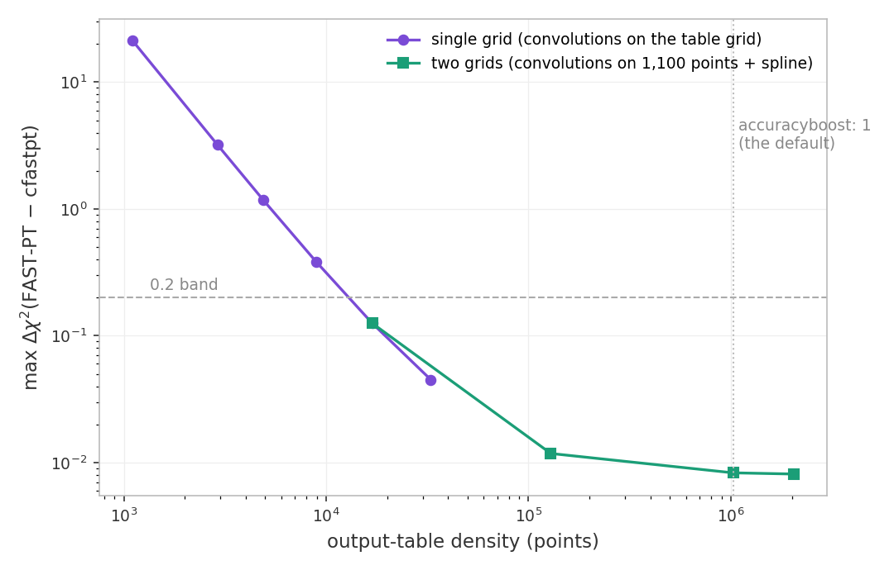
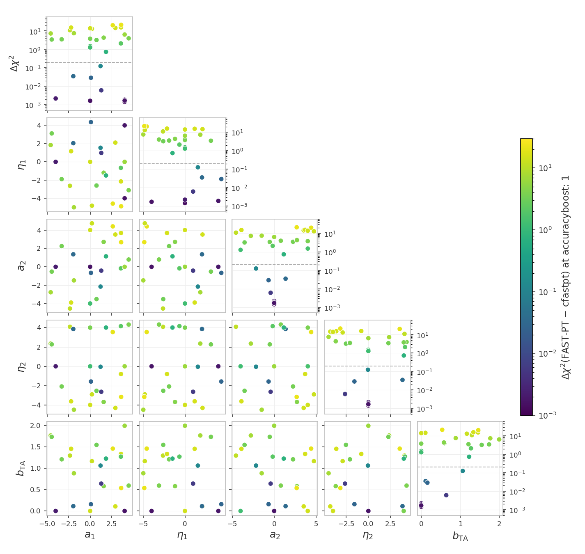

# Unit tests for the likelihoods

These tests catch two kinds of silent breakage: a $\chi^2$ that drifted
because code or data changed by accident, and a race condition (a bug
where evaluating several points in a row corrupts a later result
through leftover internal state or colliding OpenMP threads). These
tests also measure the accuracy of the hybrid emulated pipelines and
report whether they are accurate enough for data analysis (advisory:
no pass/fail).

# Table of contents

1. [Running the tests](#run_tests)
2. [The tests](#the_tests)
    1. [The CFASTPT vs FASTPT comparison](#cfastpt_fastpt)
    2. [Advisory checks](#advisory_checks)
    3. [Accuracy checks](#accuracy_checks)
    4. [The N-random-models check](#nmodels_check)
    5. [Baryonic feedback accuracy checks](#baryon_accuracy_checks)
    6. [Baryonic feedback drift tests](#baryon_drift_tests)
3. [Appendix](#appendix)
    1. [FAQ: Do the tests keep their own data?](#frozen_copy)
    2. [FAQ: Why do the TATT tests use their own data vector?](#synthetic_vectors)
    3. [FAQ: How can maintainers refresh the snapshot?](#refreeze)

## Running the tests 

We assume users are in the Conda cocoa environment from a previous
`conda activate cocoa` command, that the shell is bash, and that the
current folder is the cocoa main folder `cocoa/Cocoa`.

**Step :one:**: activate the private Python environment by sourcing
the script `start_cocoa.sh`

    source start_cocoa.sh

**Step :two:**: run the tests of this project

    python -m pytest ./projects/lsst_y1/tests

Without pytest:

    python -m unittest discover -s ./projects/lsst_y1/tests -v

The tests change no project files. Each test prints a progress line
per model build and per evaluation, then a report with the
computed $\chi^2$, the stored reference, the difference, and the pass
limit.

A full run performs about 110 likelihood evaluations and takes a
few minutes. The test files force `OMP_NUM_THREADS=4` internally.

## The tests 

The standard configurations get four tests each: a $\chi^2$ drift check
and a race-condition check, both in the NLA and in the TATT intrinsic-alignment
model. The TATT variants set

    IA_model: 1
    LSST_A2_1: 0.05
    LSST_BTA_1: 0.05
    LSST_A2_2: -1.51541

The two checks and their pass limits:

| check | pass limit                                        | a failure means                    |
|-------|---------------------------------------------------|------------------------------------|
| $\Delta\chi^2$ | the recomputed $\chi^2$ must stay within 0.2 of the value stored in `frozen/reference_chi2.json` | code or data changed the numbers |
| race condition | the fiducial evaluated on its own vs evaluated again after nine other cosmologies; the two must agree within $10^{-4}$ | leftover state or an OpenMP race   |

Everything the tests compare against lives under `frozen/`: one
snapshot of configurations, data, and reference values, captured
together when the references were generated and unchanged since. The
[Appendix](#appendix) explains how the snapshot is protected.

The test files and the configurations they cover:

| test | file | configuration | what it checks |
|---|---|---|---|
| 1 | `test_example1.py` | cosmic shear; IA modeling: NLA | $\Delta\chi^2$ against the stored reference at the fiducial point |
| 2 | `test_example1.py` | cosmic shear; IA modeling: NLA | race condition (OpenMP threading): fiducial alone vs after nine other cosmologies |
| 3 | `test_example1.py` | cosmic shear; IA modeling: TATT | $\Delta\chi^2$ against the stored reference at the fiducial point |
| 4 | `test_example1.py` | cosmic shear; IA modeling: TATT | race condition (OpenMP threading): fiducial alone vs after nine other cosmologies |
| 5 | `test_example2.py` | 3x2pt; IA modeling: NLA | $\Delta\chi^2$ against the stored reference at the fiducial point |
| 6 | `test_example2.py` | 3x2pt; IA modeling: NLA | race condition (OpenMP threading): fiducial alone vs after nine other cosmologies |
| 7 | `test_example2.py` | 3x2pt; IA modeling: TATT | $\Delta\chi^2$ against the stored reference at the fiducial point |
| 8 | `test_example2.py` | 3x2pt; IA modeling: TATT | race condition (OpenMP threading): fiducial alone vs after nine other cosmologies |
| 9 | `test_fastpt.py` | cosmic shear; IA modeling: TATT with python FAST-PT (`IA_code: 1` plus the fastpt theory block) instead of the C cfastpt | $\chi^2$ vs its own stored FASTPT reference; prints the FASTPT-minus-CFASTPT difference next to its stored value |
| 10 | `test_fastpt.py` | 3x2pt; IA modeling: TATT with python FAST-PT (`IA_code: 1` plus the fastpt theory block) instead of the C cfastpt | $\chi^2$ vs its own stored FASTPT reference; prints the FASTPT-minus-CFASTPT difference next to its stored value |
| 11 | `test_example2_2x2pt.py` | 2x2pt (`lsst_y1.combo_2x2pt`: the 3x2pt configuration reduced to galaxy clustering plus galaxy-galaxy lensing); IA modeling: NLA | $\Delta\chi^2$ against the stored reference at the fiducial point |
| 12 | `test_example2_2x2pt.py` | 2x2pt (`lsst_y1.combo_2x2pt`: the 3x2pt configuration reduced to galaxy clustering plus galaxy-galaxy lensing); IA modeling: NLA | race condition (OpenMP threading): fiducial alone vs after nine other cosmologies |
| 13 | `test_example2_2x2pt.py` | 2x2pt (`lsst_y1.combo_2x2pt`: the 3x2pt configuration reduced to galaxy clustering plus galaxy-galaxy lensing); IA modeling: TATT | $\Delta\chi^2$ against the stored reference at the fiducial point |
| 14 | `test_example2_2x2pt.py` | 2x2pt (`lsst_y1.combo_2x2pt`: the 3x2pt configuration reduced to galaxy clustering plus galaxy-galaxy lensing); IA modeling: TATT | race condition (OpenMP threading): fiducial alone vs after nine other cosmologies |
| 15 | `test_fastpt.py` | cosmic shear; IA modeling: TATT; the C cfastpt (`IA_code: 0`) vs the python FAST-PT package (`IA_code: 1`) at 30 fixed points (20 across the intrinsic-alignment prior plus a one-parameter-at-a-time family), cosmology at the fiducial | $\Delta\chi^2$ of the FAST-PT data vector against the cfastpt data vector at the same point; the cfastpt vector is that point's fiducial, so agreement means zero |

### The CFASTPT vs FASTPT comparison (`test_fastpt.py`, test 15) 

Cosmolike computes the TATT perturbation-theory integrals with two
implementations: cfastpt, the C code built into the interface
(`IA_code: 0`), and the python FAST-PT package through the fastpt
theory block (`IA_code: 1`). Test 15 evaluates both at the same 30
fixed points: 20 drawn once across the intrinsic-alignment prior and
hard-coded, plus a one-parameter-at-a-time family that names the TATT
parameter driving a divergence (every other parameter stays at the
fiducial), each implementation in its own subprocess.

At every point the cfastpt data vector is the fiducial: the reported
quantity is the $\Delta\chi^2$ of the FAST-PT vector against it,
zero for identical vectors and quadratic in their difference. A
comparison against the shipped data vector would measure the slope
of the distance to the data instead of the numerics.

The FAST-PT side runs at the fastpt block's default settings, the
converged two-grid configuration, and the pass limit is 0.2. A
second FAST-PT evaluation at doubled boosts repeats the measurement
as an advisory, so the residual grid response of the defaults shows
next to the pass quantity.

#### Why the defaults are the converged configuration 

This is a decision record (2026-09-22, this check's own sweeps). The
fastpt block computes on two grids: `accuracyboost` multiplies the
density of the output table cosmolike reads with linear
interpolation, and `internal_accuracyboost` the density of the
internal grid the FFTLog convolutions run on, with a cubic spline in
log k upsampling the terms from one grid onto the other. Both boosts
are rebased so 1.0 is the converged configuration.

The historical single-grid default, one shared 1100-point grid for
both roles, disagreed with cfastpt by up to $\Delta\chi^2 = 21$
across the intrinsic-alignment prior. Separating the two grids
located the entire divergence in the density of the interpolated
table and none of it in the convolutions:

| output table (points) | internal grid (points) | max $\Delta\chi^2$ | cost per cosmology |
|---|---|---|---|
| 1,100 | 1,100 (shared) | 21.40 | 1.05 s |
| 16,900 | 1,100 | 0.125 | 1.05 s |
| 128,900 | 1,100 | 0.0118 | 1.09 s |
| 1,024,900 (`accuracyboost: 1`, the default) | 1,100 (the default) | 0.0082 | 1.4 s |
| 2,048,900 (`accuracyboost: 2`) | 1,300 (`internal_accuracyboost: 2`) | 0.0080 | 1.7 s |

Raising the internal grid alone moves nothing (0.00830 at 1,100
points, 0.00827 at 4,900, output fixed at the default), so the
convolutions were already accurate on their default grid; the dense
splined table removes the interpolation error at almost no cost.

The one-parameter family localizes the historical divergence in the
convolution terms as read from the coarse table; the linear
tidal-alignment term needs no convolution and agrees at the
numerical floor. $\Delta\chi^2$ at the historical single-grid
default, parameters not listed at zero:

| activated parameters | $\Delta\chi^2$ |
|---|---|
| none (all IA amplitudes zero) | 0.002 |
| $a_1 = \pm 4$ | 0.001-0.002 |
| $a_2 = \pm 4$ | 1.3-1.5 |
| $a_2 = 4$, $\eta_2 = +4$ / $-4$ | 3.8 / 14.0 |
| $a_1 = 4$, $b_{\rm TA} = 2$ | 6.4 |
| $a_1 = 4$, $\eta_1 = \pm 4$ | 0.002 |

> [!NOTE]
> The fastpt defaults hold this accuracy on their own; raising the
> boosts is a convergence test, not a need. cfastpt (`IA_code: 0`)
> remains the reference implementation.

#### Running the comparison 

We assume users are in the Conda cocoa environment from a previous
`conda activate cocoa` command, that the shell is bash, and that the
current folder is the cocoa main folder `cocoa/Cocoa`.

**Step :one:**: activate the private Python environment by sourcing
the script `start_cocoa.sh`

    source start_cocoa.sh

**Step :two:**: run the comparison at the default camb/cosmolike
settings

    python -m pytest ./projects/lsst_y1/tests/test_fastpt.py

**Step :three:**: repeat it at the pushed camb/cosmolike settings

    python -m pytest ./projects/lsst_y1/tests/test_fastpt.py --high=1

> [!NOTE]
> `--high=1`: applies the pushed camb/cosmolike settings of the
> accuracy checks to every block of test 15 (tests 9 and 10 do not
> read it). The full comparison is both invocations.

### Advisory checks (`test_emul2.py`, E1-E4) 

These checks test the hybrid emulators: trained machine-learning
networks replace the Boltzmann code. There is no pass/fail; each
check prints four quantities:

| printed quantity | meaning |
|---|---|
| emulator $\chi^2$ | the emulated pipeline evaluated at the fiducial point |
| drift | change against the stored emulator reference; nonzero means the installed emulator no longer reproduces its stored $\chi^2$ |
| $\lvert\chi^2_\text{emulator} - \chi^2_\text{exact}\rvert$ | the emulator error against the exact-physics $\chi^2$ at the same cosmology |
| recommendation | RECOMMENDED for actual data analysis when $\lvert\chi^2_\text{emulator} - \chi^2_\text{exact}\rvert < 0.2$, NOT recommended otherwise |

A race-condition check (OpenMP threading) runs as well, warning
instead of failing.

> [!NOTE]
> The trained-network files are read from
> `external_modules/data/emultrf`, not from the `frozen/` snapshot; the
> network device is pinned to `cpu` so the numbers do not depend on
> GPU availability.

#### Running Advisory checks 

We assume users are in the Conda cocoa environment from a previous
`conda activate cocoa` command, that the shell is bash, and that the
current folder is the cocoa main folder `cocoa/Cocoa`.

**Step :one:**: activate the private Python environment by sourcing
the script `start_cocoa.sh`

    source start_cocoa.sh

**Step :two:**: run the advisory checks on their own

    python -m pytest ./projects/lsst_y1/tests/test_emul2.py

### Accuracy checks (`test_accuracy.py`, A1-A6) 

First we change one accuracy parameter at a time on the 3x2pt NLA
configuration, so a large $\Delta\chi^2$ can be attributed to the
parameter causing it (the scan includes `accuracyboost: 5` as a
stress test). Then checks A1-A6 re-evaluate cosmic shear, 3x2pt, and
2x2pt, with NLA and TATT, with every setting pushed beyond the
defaults at once:

| setting | raised to | what it controls |
|---------|-----------|------------------|
| `accuracyboost` (cosmolike) | 2 | sizes of cosmolike's internal lookup tables, including the dyadic z grid of the power-spectrum tables |
| `integration_accuracy` (cosmolike) | 10 | extra refinement passes of cosmolike's numerical integrals |
| `lmax` (cosmolike) | 200000 | highest multipole of the internal harmonic-space $C_\ell$ tables that cosmolike transforms into the real-space correlation functions; arcminute scales need very high $\ell$ |
| `kmax_boltzmann` (cosmolike) | 40 | the k cutoff of the power spectrum the likelihood requests from CAMB |
| `AccuracyBoost` (CAMB) | 2 | CAMB's overall accuracy multiplier: denser sampling in every internal CAMB grid, the most expensive setting |
| `k_per_logint` (CAMB) | 50 | k samples CAMB computes per logarithmic interval of the transfer functions |
| `kmax` (CAMB) | 50 | highest k of CAMB's matter power spectrum; one physical cutoff with `kmax_boltzmann`, seen from the CAMB side |

`accuracyboost` refines a nested z grid in the power-spectrum
tables: every coarser grid's nodes are a subset of every finer
grid's, so a higher boost tightens the same interpolation instead of
moving the nodes (the construction is commented in
`likelihood/_cosmolike_prototype_base.py`).

When several settings move the $\chi^2$, settle them in cost order:
raise cosmolike `accuracyboost` first (cheap), then CAMB
`k_per_logint`, and CAMB `AccuracyBoost` last (expensive at run
time, and able to masquerade for the cheap settings).
`kmax_boltzmann` and CAMB `kmax` are one physical cutoff seen from
two sides; move them together.

Each check reports the $\Delta\chi^2$ between the high-accuracy and
the default evaluations: the numerical error of the default
settings. No pass/fail.

> [!NOTE]
> High-accuracy evaluations take minutes.

#### Running Accuracy checks 

We assume users are in the Conda cocoa environment from a previous
`conda activate cocoa` command, that the shell is bash, and that the
current folder is the cocoa main folder `cocoa/Cocoa`.

**Step :one:**: activate the private Python environment by sourcing
the script `start_cocoa.sh`

    source start_cocoa.sh

**Step :two:**: run the accuracy checks on their own

    python -m pytest ./projects/lsst_y1/tests/test_accuracy.py

To run every other test while skipping these:

    python -m pytest ./projects/lsst_y1/tests --ignore ./projects/lsst_y1/tests/test_accuracy.py

### The N-random-models check (opt-in) 

This check repeats the accuracy measurement at N reproducible random
points drawn across the prior of the 3x2pt NLA configuration. Per
point:

1. draw the point;
2. generate a synthetic data vector at that point with the default
   settings;
3. evaluate the high-accuracy $\chi^2$ against that vector.

Again, we set the data vector at the point itself, so the
$\Delta\chi^2$ at the default settings is zero by construction; the
number step 3 computes is the $\Delta\chi^2$ directly.

> [!NOTE]
> The draws are reproducible: the check specifies the seed (the
> starting state) of the random number generator, so every run draws
> exactly the same points and the numbers can be compared across
> reruns and machines.

The report streams one block per model and ends with the
min/median/max $\Delta\chi^2$. Advisory: the deltas only have to be
finite.

Each model costs a default build+evaluation plus a high-accuracy
build+evaluation, minutes per model, so the check is off by default:
with `COCOA_ACCURACY_NMODELS` unset (or 0) it prints how to enable
it and passes.

#### Running the N-random-models check 

We assume users are in the Conda cocoa environment from a previous
`conda activate cocoa` command, that the shell is bash, and that the
current folder is the cocoa main folder `cocoa/Cocoa`.

**Step :one:**: activate the private Python environment by sourcing
the script `start_cocoa.sh`

    source start_cocoa.sh

**Step :two:**: enable and run the check

    COCOA_ACCURACY_NMODELS=10 python -m pytest \
        ./projects/lsst_y1/tests/test_accuracy.py -k nmodels

Running the file as a script accepts `--nmodels N` in place of the
environment variable.

### Baryonic feedback accuracy checks (`test_accuracy_baryons.py`, BF1-BF7) 

The file `test_accuracy_baryons.py` repeats the default-versus-high
accuracy comparison with the `bfmt` theory block switched on: one
advisory check per feedback method (the three SP(k) fb relations,
BCEmu, Flamingo, BACCOemu, and BCemu2025), at a fixed parameter
point per method.

Each check creates its data vector on the fly, by the same mechanism
as the N-random-models check:

1. The default-settings model writes its own theory vector during
   evaluation.
2. That vector becomes the data of a temporary dataset.
3. The pushed-settings model evaluates at the same point against it.

The fiducial $\chi^2$ is zero by construction and nothing is stored
in the snapshot, so the single reported number, $\Delta\chi^2$, is a
pure numerics response. The check BF0 additionally runs the
one-setting-at-a-time scan with the Akino SP(k) feedback on, so a
large delta names the setting causing it.

Every checked configuration is measurable by construction. The
BACCOemu check evaluates with `omegab: 0.049`, inside that
emulator's baryon-density training box, whose floor sits exactly
above the fiducial `omegab: 0.04`; and the double-power-law point is
chosen to keep the baryon fraction inside SP(k)'s calibrated band
over the full redshift grid.

#### Running the baryonic feedback checks 

We assume users are in the Conda cocoa environment from a previous
`conda activate cocoa` command, that the shell is bash, and that the
current folder is the cocoa main folder `cocoa/Cocoa`.

**Step :one:**: activate the private Python environment by sourcing
the script `start_cocoa.sh`

    source start_cocoa.sh

**Step :two:**: run the baryonic feedback checks of this project

    python -m pytest ./projects/lsst_y1/tests/test_accuracy_baryons.py

### Baryonic feedback drift tests (`test_baryons.py`, BD1-BD7) 

The file `test_baryons.py` pins the feedback pipeline against change
over time, one test per method. Each method's default-settings
theory prediction was stored at freeze time
(`generate_frozen_reference.py --baryons`), and the test evaluates
today's prediction against that stored vector: zero at freeze time
by construction, so a $\chi^2$ above the tolerance means cosmolike
or the `bfmt` theory block changed its prediction since the freeze.
These tests complement the accuracy checks above: the accuracy
checks regenerate their vector on the fly per run, so they measure
the numerical settings and can never see drift; the drift tests hold
the frozen vector still, so they measure drift and nothing else.

#### Running the baryonic feedback drift tests 

We assume users are in the Conda cocoa environment from a previous
`conda activate cocoa` command, that the shell is bash, and that the
current folder is the cocoa main folder `cocoa/Cocoa`.

**Step :one:**: activate the private Python environment by sourcing
the script `start_cocoa.sh`

    source start_cocoa.sh

**Step :two:**: run the drift tests of this project

    python -m pytest ./projects/lsst_y1/tests/test_baryons.py

# Appendix 

## :interrobang: FAQ: Do the tests keep their own data? 

The tests read nothing from the live project: not `../data`, not the
`EXAMPLE_EVALUATE` yaml files, and not the likelihood default yaml
files. Instead, `frozen/` holds:

| `frozen/` entry | holds |
|---|---|
| `frozen_config_example{1,2}.py` | the complete cobaya configuration as a yaml string, plus the exact evaluation point |
| `data/` | the tests' own copy of the data vectors, covariance, n(z), and masks |
| `EXAMPLE_EVALUATE{1,2}.yaml` | snapshots kept only so a human can diff how the live examples drifted since the freeze |

In the configuration modules every option and every parameter is
written out, including the ones that normally come from
`params_source.yaml` and the other default files, so editing those
files cannot change what the tests evaluate.

`manifest_sha256.json` stores a SHA-256 hash (a fingerprint that
changes when any byte changes) of every file under `frozen/`. Each test
verifies the manifest first and refuses to run when a file under `frozen/` was
edited, naming the file. The result: users may change the live data
and examples freely, and nobody can quietly edit the snapshot
either.

## :interrobang: FAQ: Why do the TATT tests use their own data vector? 

All TATT variants evaluate against `frozen/data/tatt_lsst_y1.dataset`,
a data vector generated with TATT at the fiducial point when the
snapshot was created. Reason: against the shipped NLA-based vector the TATT $\chi^2$
sits away from its minimum, where it responds linearly to tiny
numerical changes; at its own minimum the response is quadratic and
the drift bounds stay meaningful.

## :interrobang: FAQ: How can maintainers refresh the snapshot? 

A deliberate change to the data vectors, n(z), covariance, examples,
or likelihood defaults requires a re-freeze.

We assume users are in the Conda cocoa environment from a previous
`conda activate cocoa` command, that the shell is bash, and that the
current folder is the cocoa main folder `cocoa/Cocoa`.

**Step :one:**: activate the private Python environment by sourcing
the script `start_cocoa.sh`

    source start_cocoa.sh

**Step :two:**: rebuild the snapshot

    python ./projects/lsst_y1/tests/generate_frozen_reference.py --overwrite

It rebuilds `frozen/` from the current project, prints the four new
reference $\chi^2$ values, and rewrites the manifest. Review the printed
$\chi^2$ values against the old references before committing: they define
what every later test run compares against.
