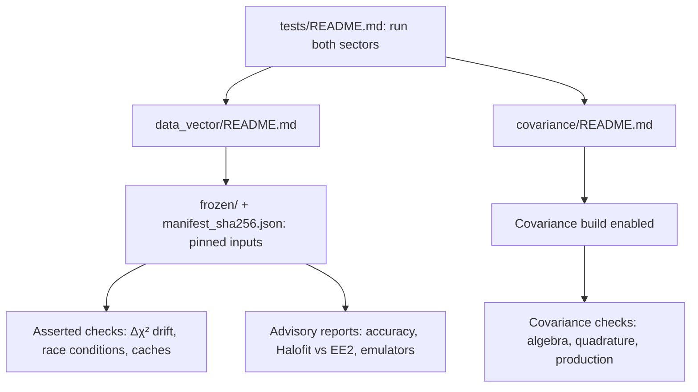

# Tests

The LSST Y1 tests are divided into two sectors.

- [Data-vector and likelihood checks](data_vector/README.md) cover the project
  predictions, frozen inputs and numerical diagnostics.
- [Covariance checks](covariance/README.md) cover forecast assembly and its
  documented component checks. Covariance generation must be compiled.


```mermaid
flowchart TB
  A["tests/README.md: run both sectors"] --> B["data_vector/README.md"]
  A --> C["covariance/README.md"]
  B --> D["frozen/ + manifest_sha256.json: pinned inputs"]
  D --> E["Asserted checks: Δχ² drift, race conditions, caches"]
  D --> F["Advisory reports: accuracy, Halofit vs EE2, emulators"]
  C --> G["Covariance build enabled"]
  G --> H["Covariance checks: algebra, quadrature, production"]
```

Every data-vector test reads only the pinned snapshot in `frozen/`.
Asserted checks fail the run when a number moves: the $\Delta\chi^2$
checks against `frozen/reference_chi2.json`, the race conditions (OpenMP
threading), the cache ladder, the FAST-PT and EuclidEmulator2
comparisons, the baryonic-feedback drift tests, the photo-z and
non-Limber switches, and the scale-cut diagnostics. Advisory checks print
measurements without a pass limit: the accuracy scans (with and without
feedback), Halofit versus EuclidEmulator2, and the hybrid emulators.

The covariance sector does not read `frozen/`; it builds its own small
inputs and needs the covariance build.

We assume Cocoa and this project are installed, the Cocoa Conda environment
is active, the shell is Bash, and the current folder is `cocoa/Cocoa/`.

Run the sectors in separate Python invocations: they initialize different
compiled-library state. Running one project at a time also avoids importing
another project's same-named test helpers.

**Step :one:**: activate Cocoa.

```bash
source start_cocoa.sh
```

**Step :two:**: run the data-vector sector.

```bash
python -m pytest ./projects/lsst_y1/tests/data_vector
```

**Step :three:**: enable covariance generation.

```bash
unset IGNORE_COSMOLIKE_LSST_Y1_COVARIANCE
```

**Step :four:**: compile the project.

```bash
source ./projects/lsst_y1/scripts/compile_lsst_y1.sh
```

**Step :five:**: run the covariance sector.

```bash
python -m pytest ./projects/lsst_y1/tests/covariance
```

The project must be enabled in `set_installation_options.sh` before
activation. A covariance skip in a deliberately disabled build is expected;
it is not a successful covariance check. Read the sector guide to distinguish
asserted regressions from advisory accuracy reports.

Frozen configurations and inputs are protected by `manifest_sha256.json`.
Do not regenerate references to silence an unexplained failure. The sector
guides document the deliberate reference-update procedure and its limits.

Hybrid examples can be checked without sampling:

**Step :one:**: check configuration 1.

```bash
python ./projects/lsst_y1/EXAMPLE_EMUL2_MINIMIZE1.py --check
```

**Step :two:**: check configuration 2.

```bash
python ./projects/lsst_y1/EXAMPLE_EMUL2_MINIMIZE2.py --check
```
